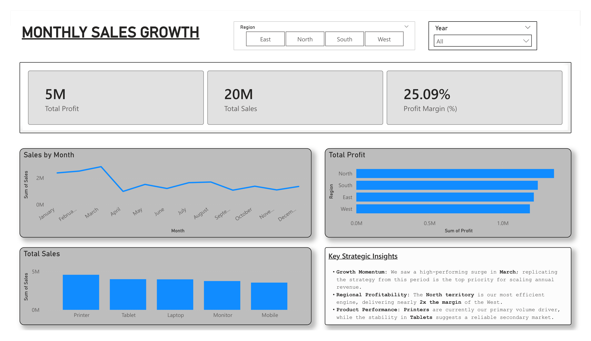

Executive Sales Analytics Pipeline :
This project is an end-to-end data engineering and analytics solution. It transforms raw, "dirty" sales data into a high-fidelity Power BI dashboard through a structured pipeline involving Python and MySQL.

Project Workflow
Data Extraction & Cleaning (Jupyter Notebook): Used Python to perform Exploratory Data Analysis (EDA), resolving missing values and eliminating duplicates to ensure data integrity.

Database Schema Design (MySQL): Architected a relational database via Command Line (CMD) to house the cleaned dataset for scalable reporting.

Business Intelligence (Power BI): Developed an interactive dashboard focusing on Total Sales (20M) and Profit Margin (25.09%).

Strategic Business Insights
Growth Momentum: High-performing surge in March identified as a priority for scaling annual revenue.

Regional Efficiency: The North territory identified as the most efficient engine, delivering nearly 2x the margin of the West.

Product Performance: Printers identified as the primary volume driver, while Tablets show a reliable secondary market.
